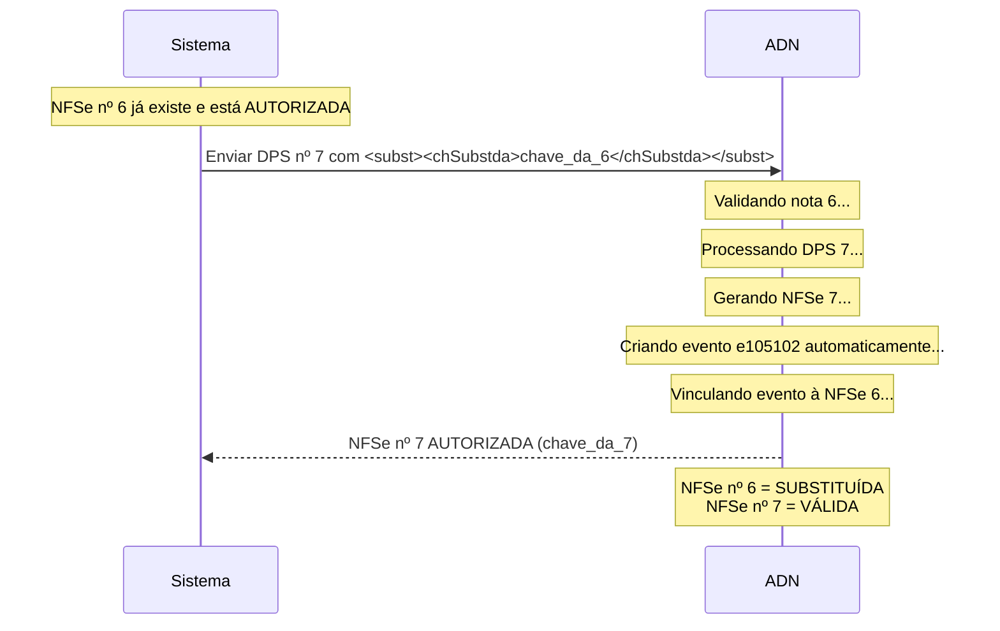

# Fluxo de Substituição de NFSe

A substituição de NFSe no padrão nacional é **automática e simplificada**. Você precisa apenas emitir a nova nota informando qual nota está sendo substituída, e o sistema ADN cuida do resto.

## 📋 Visão Geral do Fluxo

O fluxo de substituição funciona assim:

1. **Você envia** o DPS da nova NFSe (nota substituta) informando qual nota está sendo substituída
2. **O sistema ADN automaticamente**:
    - Valida a nota antiga
    - Gera a nova NFSe
    - Cria o evento de cancelamento por substituição (e105102)
    - Marca a nota antiga como "SUBSTITUÍDA"

:::tip IMPORTANTE - PROCESSO AUTOMÁTICO
Você **NÃO precisa** enviar manualmente o evento de cancelamento por substituição (e105102).

Segundo o **Manual Oficial dos Contribuintes** (v1.2 out/2025):

> "Um caso à parte ocorre quando a DPS enviada contém uma chave de acesso de uma NFS-e já gerada pelo sistema para ser substituída. A API verifica a existência desta NFS-e e, encontrada, o sistema realiza os mesmos procedimentos descritos anteriormente para validação da DPS e **gera um Evento de Cancelamento de NFS-e por Substituição**. Este evento é vinculado à NFS-e original, cancelando-a. É gerada a NFS-e substituta e retornado ao solicitante o arquivo XML da NFS-e gerada com a DPS enviada."

**Resumo**: Envie apenas o DPS da nota nova. O evento é criado automaticamente pelo ADN.
:::

---

## 1️⃣ Emitindo a Nova NFSe (Substituta)

Ao emitir a nova nota que vai substituir uma nota existente, você deve informar os dados da substituição no **DPS**, usando o elemento `<subst>`.

### Estrutura do DPS com Substituição

```php
use Nfse\Dto\Nfse\DpsData;
use Nfse\Dto\Nfse\InfDpsData;
use Nfse\Dto\Nfse\SubstituicaoData;
use Nfse\Xml\DpsXmlBuilder;

// Criar o DPS da nota NOVA (substituta)
$dps = new DpsData(
    versao: '1.00',
    infDps: new InfDpsData(
        id: 'DPS330455721190597100010500333000000000000007',
        tipoAmbiente: 2,
        dataEmissao: '2024-01-15T10:00:00-03:00',
        versaoAplicativo: '1.0.0',
        serie: '00001',
        numeroDps: '000000000000007',
        dataCompetencia: '2024-01-15',
        tipoEmitente: 1, // Prestador
        codigoLocalEmissao: '3304557',

        // INFORMAR A SUBSTITUIÇÃO
        substituicao: new SubstituicaoData(
            chaveSubstituida: 'NFS3304557211905970000105000000000000006202401123456789012', // Chave da nota ANTIGA (6)
            codigoMotivo: '99', // Código do motivo
            descricaoMotivo: 'Correção de valores' // Obrigatório se cMotivo = 99
        ),

        // ... demais dados do DPS (prestador, tomador, serviço, valores)
    )
);

// Gerar e enviar o XML
$builder = new DpsXmlBuilder();
$xml = $builder->build($dps);

// Enviar para o ADN
$resultado = $service->enviarDps($xml);

// O ADN retorna a NFSe gerada E já cria automaticamente o evento de cancelamento na nota antiga
$chaveNovaNota = $resultado->chaveNfse; // Ex: NFS3304557211905970000105000000000000007202401234567890123

echo "NFSe substituta gerada: {$chaveNovaNota}";
echo "A nota antiga foi automaticamente marcada como SUBSTITUÍDA pelo sistema!";
```

### Códigos de Motivo de Substituição

| Código | Descrição                                                                                        |
| ------ | ------------------------------------------------------------------------------------------------ |
| `01`   | Desenquadramento de NFS-e do Simples Nacional                                                    |
| `02`   | Enquadramento de NFS-e no Simples Nacional                                                       |
| `03`   | Inclusão Retroativa de Imunidade/Isenção para NFS-e                                              |
| `04`   | Exclusão Retroativa de Imunidade/Isenção para NFS-e                                              |
| `05`   | Rejeição de NFS-e pelo tomador ou pelo intermediário se responsável pelo recolhimento do tributo |
| `99`   | Outros (requer descrição no campo `xMotivo`)                                                     |

### XML Gerado (Exemplo)

```xml
<DPS versao="1.00">
  <infDPS Id="DPS330455721190597100010500333000000000000007">
    <tpAmb>2</tpAmb>
    <dhEmi>2024-01-15T10:00:00-03:00</dhEmi>
    <verAplic>1.0.0</verAplic>
    <serie>00001</serie>
    <nDPS>000000000000007</nDPS>
    <dCompet>2024-01-15</dCompet>
    <tpEmit>1</tpEmit>
    <cLocEmi>3304557</cLocEmi>

    <!-- DADOS DA SUBSTITUIÇÃO -->
    <subst>
      <chSubstda>NFS3304557211905970000105000000000000006202401123456789012</chSubstda>
      <cMotivo>99</cMotivo>
      <xMotivo>Correção de valores</xMotivo>
    </subst>

    <!-- ... demais dados -->
  </infDPS>
</DPS>
```

---

## 🔄 O Que Acontece Automaticamente no ADN

Quando você envia o DPS da nota substituta (nota 7) com a tag `<subst>`, o sistema ADN executa automaticamente:

### 1. Validação da Nota Antiga (nota 6)

-   ✅ Verifica se a chave existe no sistema
-   ✅ Verifica se não está cancelada
-   ✅ Verifica se está dentro do prazo de substituição do município
-   ✅ Valida as regras de negócio (E0042, E0044, E0046, E0050, E0056)

### 2. Processamento da Nova Nota (nota 7)

-   ✅ Valida todas as regras de negócio do DPS
-   ✅ Gera a NFSe substituta com status "AUTORIZADA"

### 3. Criação Automática do Evento e105102

-   ✅ Cria o evento "Cancelamento de NFS-e por Substituição"
-   ✅ Vincula o evento à nota antiga (nota 6)
-   ✅ Registra a chave da nota 7 como substituta no evento
-   ✅ Marca a nota 6 com status "SUBSTITUÍDA"

### 4. Retorno

-   ✅ Retorna o XML da NFSe gerada (nota 7)

:::success RESULTADO
Você envia **apenas 1 requisição** (o DPS da nota nova) e o sistema cuida de todo o resto automaticamente!
:::

---

## 🔄 Resumo do Fluxo Completo

### Cenário: Substituir a NFSe nº 6 pela NFSe nº 7



### Passo a Passo

1. ✅ **NFSe nº 6 já existe** no ADN com status "AUTORIZADA"

2. 📝 **Você emite NFSe nº 7** (nova nota):

    - No DPS da nota 7, informar `<subst><chSubstda>chave_da_6</chSubstda></subst>`
    - Enviar o DPS para o ADN via API POST /nfse

3. 🤖 **O ADN processa automaticamente**:

    - Valida a nota 6 (existe, não cancelada, dentro do prazo)
    - Processa e gera a NFSe nº 7
    - **Cria automaticamente** o evento e105102 na nota 6
    - Marca a nota 6 como "SUBSTITUÍDA"
    - Retorna a NFSe nº 7

4. ✅ **Resultado final**:
    - NFSe nº 6: status "SUBSTITUÍDA" (com evento e105102 vinculado)
    - NFSe nº 7: status "AUTORIZADA" e válida

---

## ⚠️ Regras e Restrições

### Prazos

-   Não é permitida a substituição fora do prazo estabelecido pelo município emissor (Regra E0050)
-   Consulte a parametrização municipal para verificar o prazo permitido
-   Use a API `GET /parametros_municipais/{codigoMunicipio}/convenio` para obter os parâmetros

### Validações Automáticas do Sistema

O ADN valida automaticamente:

-   **E0042**: A chave da NFSe substituída (`chSubstda`) deve ser válida
-   **E0044**: A NFSe substituída deve existir no sistema
-   **E0046**: A NFSe substituída não pode estar cancelada
-   **E0050**: A substituição deve estar dentro do prazo municipal
-   **E0056**: NFSe sem identificação do tomador pode ter restrições dependendo da parametrização municipal

### Importante

-   ✅ A nota antiga (6) **não é excluída**, apenas recebe o status "SUBSTITUÍDA"
-   ✅ A nota nova (7) é a que passa a valer para todos os efeitos fiscais
-   ✅ Ambas as notas permanecem no sistema para fins de auditoria
-   ✅ O evento e105102 fica vinculado à nota antiga para rastreabilidade
-   ❌ **Não tente** enviar manualmente o evento e105102 - o sistema já faz isso

---

## 📚 Referências

### Documentação Oficial

-   **Manual dos Contribuintes - Sistema Nacional NFS-e v1.2** (out/2025)
    -   Seção 1.3.2 - API NFS-e - Método POST /nfse
    -   Página sobre processamento de substituição

### Schemas XSD

-   [tiposComplexos_v1.01.xsd](https://github.com/nfse-nacional/nfse-php/blob/main/references/schemas/tiposComplexos_v1.01.xsd) - Linhas 849-876 (TCSubstituicao)
-   [tiposEventos_v1.01.xsd](https://github.com/nfse-nacional/nfse-php/blob/main/references/schemas/tiposEventos_v1.01.xsd) - Linhas 228-260 (TE105102 - Evento gerado automaticamente)

### Outras Referências

-   [Regras do Schema DPS](./schema-rules#regras-de-substituição)
-   [Eventos (Cancelamento)](./eventos)
-   ANEXO_I-SEFIN_ADN-DPS_NFSe-SNNFSe.xlsx - Leiautes e Regras de Negócio
